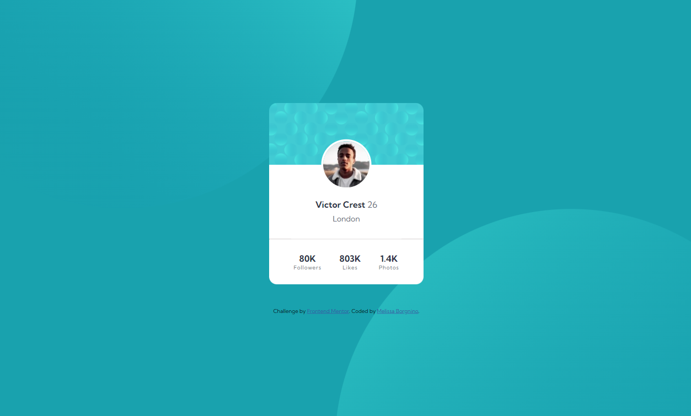

# Frontend Mentor - Profile card component solution

This is a solution to the [Profile card component challenge on Frontend Mentor](https://www.frontendmentor.io/challenges/profile-card-component-cfArpWshJ). Frontend Mentor challenges help you improve your coding skills by building realistic projects. 

## Table of contents

- [Overview](#overview)
  - [The challenge](#the-challenge)
  - [Screenshot](#screenshot)
  - [Links](#links)
- [My process](#my-process)
  - [Built with](#built-with)
  - [What I learned](#what-i-learned)
- [Author](#author)

## Overview

### The challenge

- Build out the project to the designs provided

### Screenshot



### Links

- Solution URL: [Solution](https://github.com/melissabo94/profile-card)
- Live Site URL: [Add live site URL here](https://melissabo94.github.io/profile-card/)

## My process

### Built with

- Semantic HTML5 markup
- CSS custom properties
- Flexbox

### What I learned

```css
body {
    font-family: 'Kumbh Sans', sans-serif;
    background-color: hsl(185, 75%, 39%);
    display: flex;
    flex-direction: column;
    justify-content: center;
    align-items: center;
    min-height: 100vh;
    background-image: url(images/bg-pattern-top.svg), url(images/bg-pattern-bottom.svg);
    background-repeat: no-repeat, no-repeat;
    background-position: right 80vh bottom 50vh, left 80vh top 50vh;
}

.profile img {
    border-radius: 50%;
    border: 4px solid white;
    margin-top: -52px;
}
```
## Author

- LinkedIn - [Melissa Borgnino](https://www.linkedin.com/in/melissa-borgnino-909712198/)
- Frontend Mentor - [@melissabo94](https://www.frontendmentor.io/profile/melissabo94)

